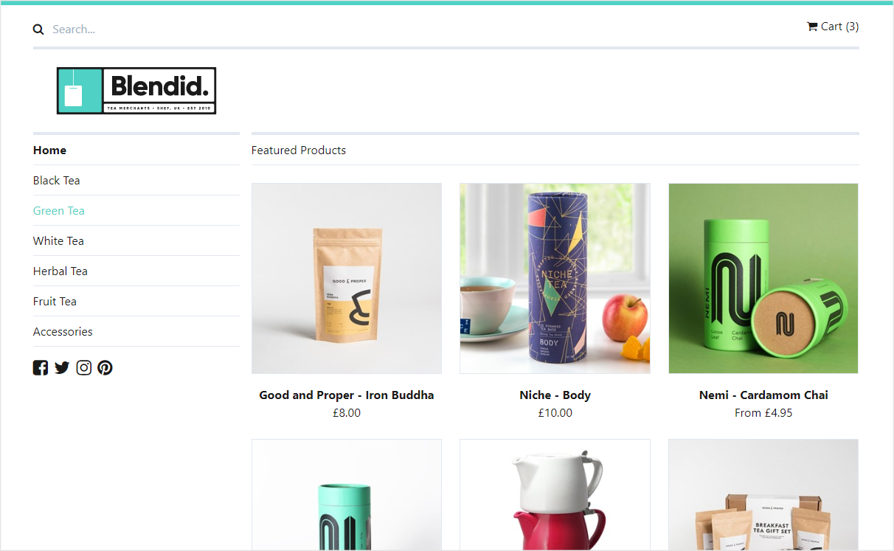

# Vendr Demo Store

Welcome to the Vendr Demo Store, an example webstore setup using [Vendr](http://getvendr.net) in [Umbraco v8 or v9](https://umbraco.com).



## About this Demo

In this repo you will find a fully configured basic webstore using Vendr on Umbraco. There are two branches with build for both v8 (.NET Framework) and v9 (.NET Core). The store is based around a fictitious tea retailer called Blendid which lists a variety of teas from multiple companies and also displays them in categories. Where products have multiple pricing options, variant nodes are used to provide buying options for those particular product choices.

The site also showcases a basic shopping cart setup with cart management features via the Vendr API as well as a checkout flow following all the main steps required for a Vendr order entity. On checkout, there will also be examples of order confirmation emails that will be sent (**TIP** Use something like [Papercut](https://github.com/ChangemakerStudios/Papercut) to capture these without them needing to be actually sent).

In the back office you'll find a suggested content structure for a working Vendr webstore and you'll also be able to browse the store setup and example orders in the settings and commerce sections respectively.

## System Requirements

To get started with the Vendr demo store you will need:

* Visual Studio 2017 (15.9.7+)
* .NET SDK 4.7.2 or .NET 5.0

## Getting Started

Clone or download this repository locally (it includes all the files you will need including a fully configured SQL CE database)

````
git clone https://github.com/vendrhub/vendr-demo-store.git
````

Once you have the repository cloned, switch to the branch for the version of Vendr/Umbraco you wish to use (either `v2/netframework/main` or `v2/netcore/main`). You can then open the `Vendr.DemoStore.sln` solution file in the root of the repository in Visual Studio. Make sure the `Vendr.DemoStore.Web` project is the startup project by right clicking the project in the Solution Explorer and choosing `Set as StartUp Project`, and then press `Ctrl + F5` to launch the site.

To login to the back office you can do so using the credentails:

* **Email** admin@admin.com
* **Password** password1234

## Documentation

If you want to get a better understanding of what Vendr does under the hood then you can checkout out the [documentation on the Vendr site](https://vendr.net/docs/). There you will find information on all the key concepts as well as detailed technical references.

## Getting Help

If you require any help with setup or you are having problems getting it working, please ask for help on our [Support Forums](https://our.umbraco.com/packages/website-utilities/vendr/vendr-support/)

## Raising an Issue

If you find any issues with the demo store itself please raise them in the [issues section of this repository](https://github.com/vendrhub/vendr-demo-store/issues), if the issue is a core Vendr product issue however, please raise these in the [issue tracker on the Vendr repository](https://github.com/vendrhub/vendr/issues)

## License

Copyright © 2019 Outfield Digital Ltd

This demo store is [licensed under MIT](LICENSE.md). The core Vendr product is licensed under an [Outfield Digital commercial license](https://vendr.net/licence-agreement/).

